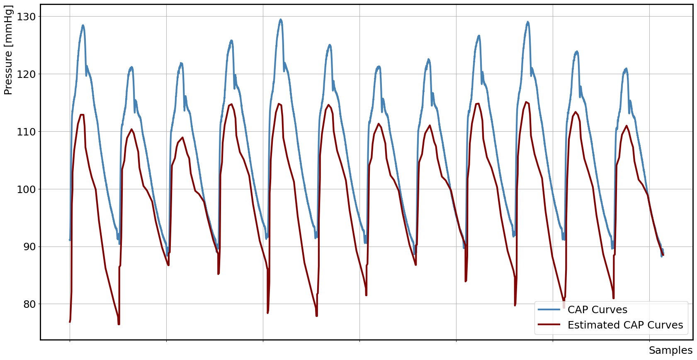
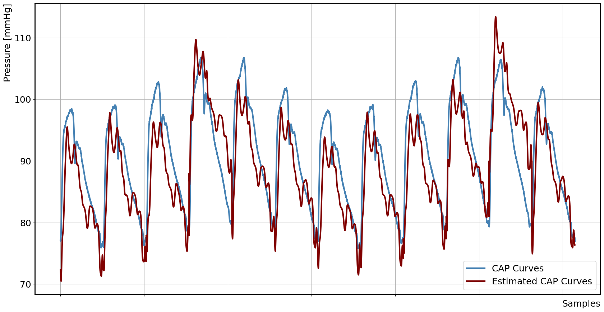
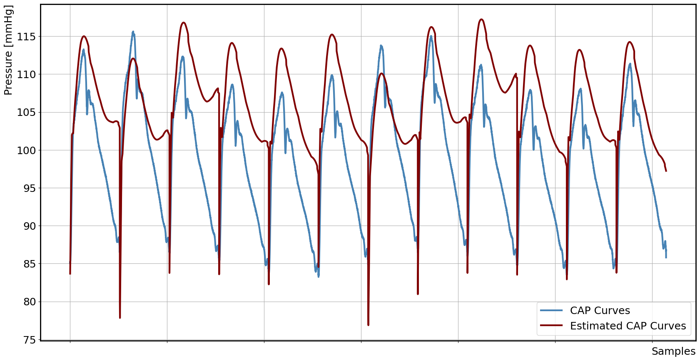

# Machine Learning based Estimation of Aortic Pressure Curves by Electrical Impedance Tomography
This repository contains algorithms, training routines and results for EIT based estimation of central aortic pressure (CAP) curves  


----------------------------------------------------------------------------------------------------------------------------------------
----------------------------------------------------------------------------------------------------------------------------------------
__Abstract:__   
Central aortic pressure is a key hemodynamic
parameter to monitor and target in clinical practice. As this
gold standard method is highly invasive and conventional non-
invasive methods are not long-term compatible or inaccurate,
the need for alternative monitoring capabilities arises. Electrical
impedance tomography (EIT) is a non-invasive monitoring
technique using an electrode belt around the torso. In this
paper, EIT recordings from an in-vivo animal model and
simultaneously recorded central aortic pressure measurements
from invasive catheters are used to train a convolutional neural
network predicting aortic pressure curves from EIT voltages.
Different parametric representations of the aortic pressure
time series are considered to reduce network complexity. A
hyperparameter tuning is conducted to optimize the network.
Results demonstrate that the estimation of aortic pressure
curves by a trained network is feasible even on unknown test
data, however, random offsets are observed.  

----------------------------------------------------------------------------------------------------------------------------------------
----------------------------------------------------------------------------------------------------------------------------------------


## Overview:
- [Structure](#structure)
- [Installation](#installation)
- [Evaluation Results](#evaluation)
- [Author](#author)


## Structure
This repository includes:
- estimte_parametrization.py: A script to create parametric representations of aortic pressure curves and save them as .mat files. Parametric techniques:
  - Piecewise Linear Regression
  - Spectral Estimation with Cauchy-Lorentz Pulses
  - Hierarchical Approach
- train_model_XX.py : To train the with Kerastuner designed CNNs for estimation and save them.
- eval_nn_XX.ipynb: Notebooks that show the results on the test data sets for all three parameterization techniques.


## Installation
Clone the repository:
```bash
 git clone https://github.com/EITLabworks/ML-based-Estimation-of-Aortic-Pressure-Curves-by-EIT.git
```


## Evaluation Results
### Piecewise Linear Regression


### Spectral Estimation


### Piecewise Linear Regression



## Author
This repository is created by Patricia Fuchs, Institute of Communications Engineering, University of Rostock, Germany.   
The research is explained and summarized in the paper "Machine Learning based Estimation of Aortic Pressure Curves by Electrical Impedance Tomography" for the "Annual International Conference of the IEEE Engineering in Medicine and Biology Society" (EMBC) 2025.  
For questions, please contact: pat.fuchs@uni-rostock.de


Please [see] (https://ieeexplore.ieee.org/document/11254609) or cite this paper:  
'''
@INPROCEEDINGS{11254609,
  author={Fuchs, Patricia and Richter, Henryk and Thönes, Jacob P. and Krukewitt, Lisa and Mueller-Graf, Fabian and Zitzmann, Amelie R. and Böhm, Stephan H. and Reuter, Daniel A. and Spors, Sascha and Kuehn, Volker},
  booktitle={2025 47th Annual International Conference of the IEEE Engineering in Medicine and Biology Society (EMBC)}, 
  title={Machine Learning based Estimation of Aortic Pressure Curves by Electrical Impedance Tomography}, 
  year={2025},
  volume={},
  number={},
  pages={1-7},
  keywords={Training;Torso;Electrical impedance tomography;Voltage measurement;Estimation;Training data;Ventilation;Pressure measurement;Monitoring;Tuning},
  doi={10.1109/EMBC58623.2025.11254609}}
  '''
